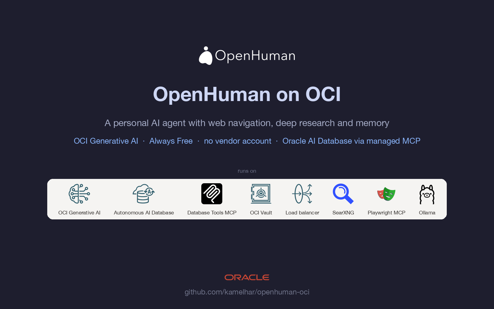
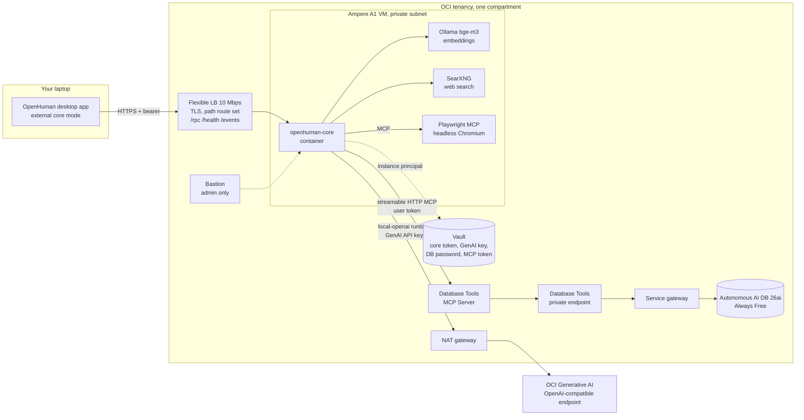

# OpenHuman on OCI

Run [OpenHuman](https://github.com/tinyhumansai/openhuman), the open-source
personal AI agent, on Oracle Cloud Infrastructure: inference from **OCI
Generative AI**, agent access to **Oracle AI Database** through Oracle's managed
**Database Tools MCP Server**, everything else on **Always Free** resources, all
of it in Terraform.

[](LICENSE)
[](deploy/terraform)
[](https://github.com/tinyhumansai/openhuman)

## Why

OpenHuman's headless core is normally hosted on a laptop or a generic VPS. This
repository answers two questions nobody had answered yet:

1. Can the core run on OCI with **no TinyHumans account**, using OCI Generative
   AI as its only model provider? Yes. The OpenAI-compatible endpoint is wired
   in as a caller-owned runtime, which bypasses the sign-in gate that custom
   cloud providers hit.
2. Can its agents reach **Oracle Database** the governed way, through the
   managed MCP server with IAM and app roles rather than a wallet in a container?
   Yes, with a user token; the client-credentials shortcut is not authorizable
   today, and the repo documents why.

The pattern is harness-neutral. Swap OpenHuman for any OpenAI-compatible agent
harness and the OCI side stays the same.

## The user story

> As an engineer whose company runs on Oracle Database, I want a personal AI
> agent that works over my own notes, mail and code **and** answers questions
> from our Oracle data in plain language, keeps working when my laptop is
> closed, and does all of it inside our OCI tenancy with database access
> governed by our IAM roles, so that I stop pasting company data into a public
> chatbot and stop keeping database wallets on laptops.

Definition of done, and where the pilot stands:

| Criterion | Status |
| --- | --- |
| Inference never leaves our cloud | done: OCI Generative AI via the OpenAI-compatible endpoint |
| No third-party account required | done: session-free `local-openai` mode |
| Agent reaches Oracle data only through governed access | built: managed Database Tools MCP Server, IAM policy, app role; waiting for the user token |
| Answers are remembered | done: memory tree with local embeddings |
| Always on | done: headless core on an Always Free VM |
| One command to build, one to tear down | done: `terraform apply` / `destroy` |
| Fits a personal account | done: everything Always Free except GenAI tokens |

Two supporting stories ride on the same stack: a platform engineer who wants
one governed way for *any* agent harness to reach Oracle Database, and an
advocate who needs a live, reproducible demo of OCI for agents.

## Showcase video

[](media/openhuman-oci-showcase.mp4)

One scripted session against the live deployment: the edge checks, a headless
browser drive to oracle.com/mcp, a web research turn that stores its findings
in memory, and the memory answering later without the web. Recorded with
`media/demo.tape` (VHS) driving `deploy/scripts/demo.sh`; the title, screenshot
and outro cards are rendered by `media/`. Re-record with `vhs media/demo.tape`.

## What gets built



| Layer | Resources | Cost |
| --- | --- | --- |
| Network | VCN, public and private subnets, internet/NAT/service gateways, three NSGs | free |
| Compute | Ampere A1 VM (3 OCPU, 18 GB, Ubuntu 24.04), 50 GB boot, 50 GB workspace volume | free (Always Free allowance) |
| Core | Upstream `openhuman-core` release binary in a container, Ollama for embeddings, systemd timer that renders secrets and settings | free |
| Research | SearXNG container for web search, Playwright MCP container for headless browser navigation, built-in page reader; all private to the compose network | free |
| Inference | OCI Generative AI via the OpenAI-compatible endpoint, API key in Vault | per token |
| Database | Autonomous AI Database 26ai, TLS without wallet, access list = VCN + your IP | free |
| Agent to DB | Database Tools private endpoint, connection, managed MCP Server, identity-domain group with the MCP_Operator role | free |
| Edge | Reserved public IP, flexible load balancer, generated CA and certificate, path allowlist | free |
| Ops | Vault with five secrets, Bastion, log group with the MCP invoke service log | free |

Once up, a single agent turn can navigate a live page in the headless browser, search the web through SearXNG, read Oracle docs, and store what it learned in memory; see the showcase in `docs/PILOT.md`.

A full apply is about 55 resources and 20 minutes. `terraform destroy` removes
everything, including the compartment.

## Quick start

Prerequisites: Terraform 1.5+, OCI CLI, `jq`, Python 3, an API-key profile in
`~/.oci/config` with admin rights, your public IP, an SSH public key.

```bash
git clone https://github.com/kamelhar/openhuman-oci && cd openhuman-oci/deploy/terraform
cp terraform.tfvars.example terraform.tfvars      # fill in; gitignored
terraform init && terraform apply

cd ../scripts
./01-genai-api-key.sh        # mint a GenAI API key, store it in Vault
./02-trust-lb-cert.sh        # trust the generated CA (macOS)
# identity domain console: My profile -> Tokens and keys -> My access tokens ->
#   Invokes other APIs -> select the "<prefix>-adb-mcp" app -> download tokens.tok
./03-register-mcp.sh ~/Downloads/tokens.tok   # into Vault; the VM registers the server
python3 04-seed-demo-data.py                   # demo ORDERS table (or run it on the VM)
```

Then open the OpenHuman desktop app, use the Advanced panel on the sign-in
screen, and enter `terraform output core_rpc_url` with the core token from
Vault. The full run book, including the smoke test, is in
[`deploy/README.md`](deploy/README.md).

## What we learned deploying it

Short version; details and evidence in [`docs/PILOT.md`](docs/PILOT.md).

- The upstream aarch64 binary needs glibc 2.39, so the runtime image is Ubuntu 24.04, not Debian.
- A headless core has no OS keychain and upstream cannot inject the encrypted-file master key; the pilot runs the file keyring on the encrypted block volume.
- Custom cloud providers are gated behind a TinyHumans session; caller-owned runtimes are not. OCI GenAI runs as the `local-openai` runtime.
- OCI load balancers cannot filter paths in ALLOW rules; the allowlist is a path route set with an empty default backend.
- A Terraform-made OAuth client gets a valid token for the MCP server, yet IAM cannot authorize it as a principal. The invoke service log is the only place that names the missing permission.
- Web search and browser navigation need no vendor account either: SearXNG and Playwright MCP run as containers beside the core, and MCP tools are loaded through `tool_search` on demand.

## Repository layout

| Path | Contents |
| --- | --- |
| [`docs/ARCHITECTURE.md`](docs/ARCHITECTURE.md) | Reference design: deployment shapes, OCI service mapping, security posture, egress, phased plan |
| [`docs/PILOT.md`](docs/PILOT.md) | What was built, decisions, results, current state, operating notes |
| [`docs/PILOT-ACCOUNT-VALIDATION.md`](docs/PILOT-ACCOUNT-VALIDATION.md) | Read-only check that the pilot fits a personal account on Always Free |
| [`docs/usecases/alzheimers-trial-landscape.md`](docs/usecases/alzheimers-trial-landscape.md) | The showcase use case: 4,300 public Alzheimer's trials in the database, governed SQL via MCP, sub-agent web research, deep dives, memory |
| [`docs/UPSTREAM.md`](docs/UPSTREAM.md) | What from here can go into OpenHuman, where, and under which rules |
| [`AGENTS.md`](AGENTS.md) | The codex: purpose, order of operations, invariants and prohibitions for coding agents (Codex, Claude Code) and operators |
| [`deploy/terraform/`](deploy/terraform) | The stack. One root module, variables documented in `variables.tf` |
| [`deploy/vm/`](deploy/vm) | Fetched by the VM at boot: core Dockerfile, compose file, secret and settings renderer, systemd units |
| [`deploy/scripts/`](deploy/scripts) | Steps Terraform cannot do: GenAI key, CA trust, MCP token, demo data |

## Roadmap

| Phase | State |
| --- | --- |
| 1. Always Free pilot on one VM | deployed, see `docs/PILOT.md` |
| 2. Upstream contributions | started: issues #6925, #6926, #6927 and PRs #6928, #6929 open on tinyhumansai/openhuman; tracker in `docs/UPSTREAM.md` |
| 3. OKE variant with one core per user and an in-tenancy inference gateway | designed in `docs/ARCHITECTURE.md`, not started |
| 4. Sovereign build on `openhuman-embed` with no TinyHumans backend | designed, not started |

## About OpenHuman

OpenHuman (GPL-3.0, TinyHumans) is a Rust core behind a Tauri desktop app: a
local-first memory built from your mail, chat and documents, a durable agent
orchestrator, and a researcher with native tools plus any MCP server. The core
also ships headless, which is what runs here. This repository downloads the
upstream release binary at deploy time and does not vendor or modify its code.

## Contributing, security, license

See [`CONTRIBUTING.md`](CONTRIBUTING.md) and [`SECURITY.md`](SECURITY.md).
Licensed under [Apache-2.0](LICENSE). No OCIDs, IPs, profile names, account
names or secrets belong in this repository; the contributing guide explains the
rule.
