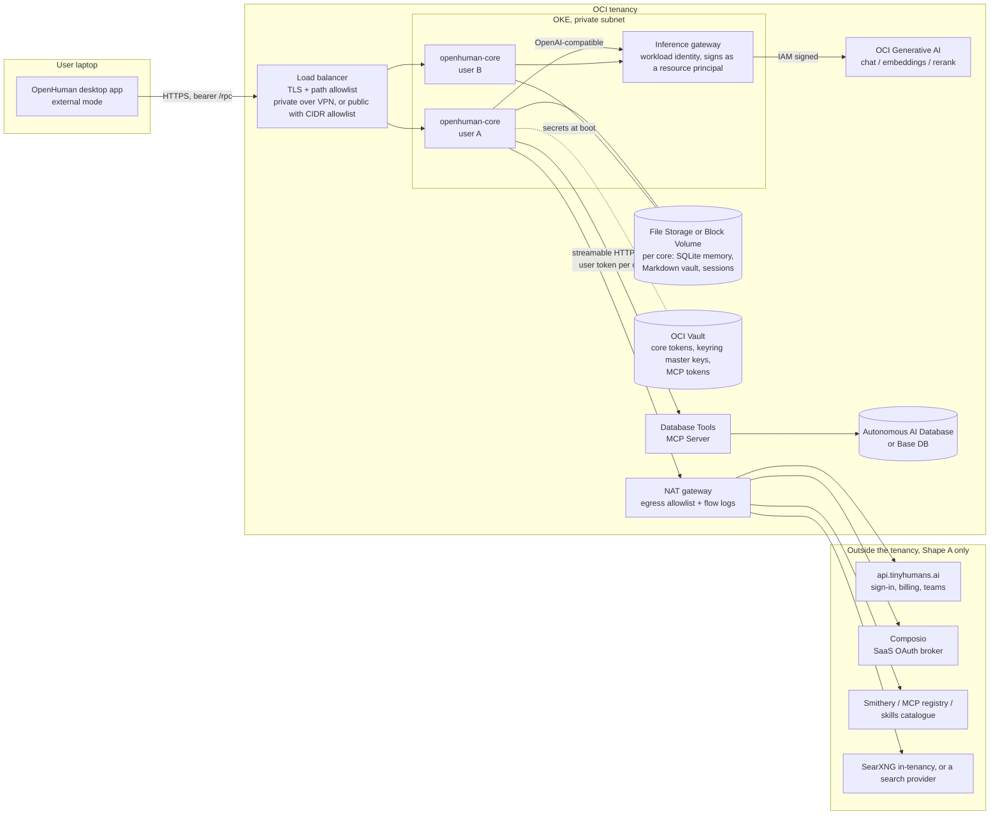

# OpenHuman on OCI: reference architecture

Status: design document, the space of options and the target shape, based on OpenHuman docs and source as of v0.64.x (October 2026). What was actually built, measured and filed is the architecture reference, [`OPENHUMAN-ON-OCI.md`](OPENHUMAN-ON-OCI.md); the day-by-day notes are in [`PILOT.md`](PILOT.md). Where the pilot disagreed with this design, the finding is marked **Pilot result** inline and the design text is left so the reasoning stays visible.

## 0. User stories

The core story, and the only reason to run the core anywhere but a laptop:

> As an OpenHuman user, I want my assistant to keep working when my laptop is
> closed, so that auto-fetch keeps pulling my data every twenty minutes,
> scheduled workflows run, and it answers me on Telegram, Slack or email at any
> hour.

The two clauses that make it an OCI story rather than a hosting story:

> ... and my prompts and memory embeddings go to models in a cloud I already pay
> for and trust, not through the vendor's inference proxy.

> ... and it can answer questions about data in my Oracle Database, using the
> database's own access controls, without me writing SQL or copying data out.

If neither clause matters to the person deploying, use the upstream Fly or
DigitalOcean recipe instead.

## 1. The first decision: which unit to deploy

OpenHuman is a single-user desktop product with a headless core. There are two
credible ways to put it on OCI, and everything else follows from the choice.

### Shape A: personal core in your tenancy

Run the headless core, one instance per user, on a VM, OCI Container Instances
or OKE. The desktop app connects in external mode
(`OPENHUMAN_CORE_RUN_MODE=external`) over a private path. Inference is OCI
Generative AI through its OpenAI-compatible endpoint. Databases are reached
through Oracle's managed MCP servers.

**Pilot result.** The published `ghcr.io/tinyhumansai/openhuman-core` image is
amd64 only. On Ampere A1 the unit is the upstream release tarball on Ubuntu
24.04 (it needs glibc 2.39); no build step.

Pros: fast to stand up; matches the upstream DigitalOcean / Fly recipes; keeps
the full feature set including the 118+ SaaS integrations.

Cons: the core still requires `BACKEND_URL` to reach `api.tinyhumans.ai` for
sign-in, billing and teams. SaaS integrations run through Composio, a third-party
broker that holds the OAuth tokens. Single bearer token per core, no per-user
isolation inside one core.

**Pilot result.** `BACKEND_URL` stays set but carries no credential and does
no inference. A caller-owned local runtime (`local-openai`) pointed at OCI
Generative AI needs no TinyHumans session at all; the native custom-provider
route does (upstream #6601).

### Shape B: sovereign

Build a thin Rust service on the `openhuman-embed` crate (plus `openhuman-rpc`
contracts for the wire format). The docs state the base embed crate makes no
TinyHumans connection: agents, memory, skills, tools and RPC all run in-process.

Pros: nothing leaves the tenancy except what you route out. This is the shape an
enterprise security review will accept.

Cons: you lose Composio integrations, hosted voice / speech-to-text, teams and
billing. You own the serving layer and auth. The upstream UI is not shipped as a
production web app yet, so clients are the desktop app in external mode, the
TUI, or your own front end.

### Recommendation

Build the reference architecture as Shape A now. Keep every OCI component
identical for both shapes so the move to B is a container image swap, not a
redesign. Treat B as the enterprise target.

The pilot that was actually built from this design, with its decisions and
results, is in [`PILOT.md`](PILOT.md).

## 2. Component mapping

*As built in the pilot (Shape A on one Always Free VM). Every component below is described, measured and sourced in the architecture reference.*

**Target design for phase three** (OKE, one core per user, in-tenancy gateway). GitHub renders this block:

The gateway box is conditional: it earns its place only where it can sign
requests as a resource principal (OKE workload identity). Where it cannot, the
pilot's arrangement stands: a Generative AI API key, itself a policy-governed
principal, and local embeddings.

### 2.1 Compute

| Option | When |
| --- | --- |
| OKE, one Deployment per user, PVC on Block Volume or File Storage | Many users, GitOps, External Secrets Operator for Vault. Worker nodes draw on the same A1 allowance, so not Always Free in practice |
| OCI Container Instances, one per user | Simplest for a handful of users; not Always Free |
| Compute VM + Docker Compose, release tarball on Ubuntu 24.04 | **The pilot.** Always Free on Ampere A1. Upstream container images are amd64 only; the aarch64 tarball needs glibc 2.39 and no build |

Upstream sizing claim: a minimal build is a ~60 MiB stripped binary and hosts
hundreds of agents on 2 vCPU / 2 GB. No GPU is required unless you run a local
embedding model (see 2.2).

### 2.2 Inference: OCI Generative AI

OCI GenAI exposes an OpenAI-compatible surface at
`https://inference.generativeai.<region>.oci.oraclecloud.com/openai/v1`
(chat completions, responses, conversations, files, vector stores, containers),
authenticated with either GenAI API keys (`Authorization: Bearer sk-...`) or OCI
IAM request signing.

OpenHuman accepts a custom OpenAI-compatible provider registered under your own
slug, and assigns providers per workload hint (`hint:reasoning`, `hint:fast`,
`hint:vision`, `hint:summarize`, `hint:code`, `hint:burst`).

**Pilot result.** In headless `serve` mode custom cloud providers are gated
behind a TinyHumans session or API key (`SESSION_EXPIRED` on every turn).
Caller-owned local runtimes are exempt, so the pilot registers OCI Generative AI
as the `local-openai` runtime (`LOCAL_OPENAI_URL` plus `local_ai.api_key`) and
pins every role to `local-openai:<model>@<temperature>` through the settings
RPC. Hand-written `config.toml` entries do not route; only the RPC completes a
provider route. Local-runtime profiles use a prompt-guided tool dialect, which
is why the reliability recipe in the reference (section 10.3) exists.

Two gaps make a gateway worthwhile:

1. **Embeddings and rerank are not on the OpenAI-compatible endpoint.** They are
   only on the OCI-native API. OpenHuman's memory tree needs an embeddings
   provider (OpenAI, Voyage, Cohere, Ollama or custom OpenAI-compatible).
2. **Static API keys.** OCI positions API keys for development and IAM for
   production. OpenHuman can only send a bearer.

Design intent: an in-tenancy gateway signing as a resource principal in front
of OCI GenAI, so that OpenHuman sees one OpenAI-compatible base URL for chat,
embeddings and rerank and no OCI credential lives in the workspace.

**Pilot result.** The LiteLLM proxy's OCI integration cannot sign with an
instance principal today, so a gateway on the VM would have reintroduced a user
API key. The pilot uses a Generative AI API key directly (it is a policy-governed
principal, `request.principal.type='generativeaiapikey'`) and an Ollama sidecar
serving `bge-m3` for embeddings, which the upstream docs call the recommended
local embedder. Revisit the gateway on OKE, where workload identity can sign.

Routing, with what the pilot measured on 2026-10-02:

| Hint | Model family | Pilot result |
| --- | --- | --- |
| reasoning, chat, agentic | `openai.gpt-4.1` | Works through `local-openai`; the pilot's model for every role |
| reasoning (stronger) | `openai.gpt-5`, `gpt-5.2`, `gpt-5.4`, `gpt-5.6-sol` | Reachable directly; fail through the harness, which sends `max_tokens` where these models require `max_completion_tokens` (tinyinference fix pending) |
| reasoning (alternative) | `xai.grok-4` | 404 on the OpenAI-compatible endpoint in the pilot region |
| fast, burst | `meta.llama-3.3-70b-instruct`, `openai.gpt-oss-120b` | Not exercised in the pilot |
| vision | `meta.llama-4-scout-17b-16e-instruct` | Not exercised |
| embeddings | `cohere.embed-v4.0` via a gateway only | Native API only; the pilot embeds with `bge-m3` on Ollama |

### 2.3 Oracle Database access for agents

Three Oracle-native MCP options. OpenHuman's `mcp.json` accepts stdio servers
and remote servers as `{ url, headers }` over streamable HTTP.

| Server | Transport | Auth | Use |
| --- | --- | --- | --- |
| **OCI Database Tools MCP Server** (managed, serverless) | streamable HTTP | User tokens: a personal access token from the identity domain (the pilot), or OAuth sign-in. Server runs as a resource principal to reach Database Tools connections and Vault secrets. **Pilot result:** a client-credentials token is accepted at the endpoint but IAM cannot authorise the caller (`-32007`); on-behalf-of with a trusted client is untested | **Default.** Zero cost, IAM RBAC, works with ADB, Base DB and on-prem via private endpoint |
| **ORDS `/mcp` endpoint** | streaming HTTPS | OAuth2 / JWT | Shops that already run ORDS |
| **SQLcl MCP Server** | stdio | saved SQLcl connections | Dev only. Needs Java and a wallet inside the container |

Identity caveat: one core token means every SQL statement runs under one
database identity. Per-user OAuth on the Database Tools MCP Server only helps if
each user has their own core. This is another reason for the per-user shape.
Run DB-facing agents at the `readonly` or `supervised` access tier so writes
pause for approval.

**Pilot result.** The remote MCP client sends static headers
(`mcp_clients_config_set` with `url` and `headers`); there is no headless
authorization-code flow. The pilot stores a personal access token in Vault and
the VM registers the server from there; rotation is a new token and one script.

### 2.4 Memory and storage

Memory is SQLite (`<workspace>/memory_tree/chunks.db`, FTS5 plus embeddings),
the Markdown vault (`<workspace>/wiki/`), session DBs and agent skills, all under
the workspace directory. Upstream applies AES-256-GCM at rest keyed by Argon2id.

| Concern | OCI answer |
| --- | --- |
| Persistence | One Block Volume (or File Storage export) per core, with a backup policy |
| Encryption key | Seed the master key from OCI Vault at boot. **Pilot result:** release 0.64.10 cannot take a master key from the environment and falls back to the plaintext file keyring (`OPENHUMAN_KEYRING_BACKEND=file`) on the encrypted volume; upstream PR #6935 adds `OPENHUMAN_KEYRING_MASTER_KEY`, the Terraform already keeps the key in Vault, and the renderer switches to `encrypted_file` on the first newer release |
| Oracle AI Database as the memory store | Possible but partial. `tinymemory` admits external drivers (Supermemory, Mem0, Cognee, AgentMemory via REST) and ships a conformance suite. An Oracle AI Database 26ai driver (vector search plus Oracle Text for hybrid recall) is a bounded project. The Memory Tree chunk pipeline stays on local SQLite regardless, and the docs call the REST backend "not the recommended extension point". Phase 2, and do not promise "memory lives in Oracle DB" without a fork |

### 2.5 Secrets

| Secret | Where |
| --- | --- |
| `OPENHUMAN_CORE_TOKEN` (full control of the core) | OCI Vault, injected as an env var; rotate on schedule |
| `OPENHUMAN_BACKEND_API_KEY` (Shape A only) | OCI Vault |
| GenAI API key (only if no gateway) | OCI Vault, two-secret rotation |
| MCP personal access tokens | OCI Vault |
| Keyring and memory master key | OCI Vault (generated by Terraform, 64 hex) |

OKE: External Secrets Operator with the OCI Vault provider. Container Instances:
Vault secret references in the environment.

### 2.6 Network and client access

The core binds `0.0.0.0:7788`. `/rpc` requires the bearer token. `/health`,
`/events` and `/ws/dictation` are unauthenticated in the current build, and the
events stream carries agent activity. The core itself never gets a public IP.

| Deployment | Client path |
| --- | --- |
| Pilot, users outside a corporate network | Public OCI Load Balancer with TLS and a **path allowlist that forwards only `/rpc`, `/health` and `/events`** (the desktop app needs the event stream). **Pilot result:** `ALLOW` rule sets cannot match paths, so the allowlist is a path route set with an empty default backend set; a WAF rate-limit rule was not needed for one operator and is not Always Free. Dictation over the network is lost; use the desktop app's local dictation instead |
| Oracle internal | Private OCI Load Balancer reached over the corporate VPN or FastConnect. Nothing public |
| Admin / break-glass | OCI Bastion port-forward to the nodes or pods. Not the daily client path: sessions expire after three hours and need SSH |

Network Security Group on the core: inbound 7788 only from the load balancer
subnet. Rotate the bearer token on a schedule and after any suspected leak.

### 2.7 Egress governance (Shape A)

Route through a NAT gateway with an allowlist and log flows. Expected
destinations:

| Destination | Why | Shape B |
| --- | --- | --- |
| `api.tinyhumans.ai` | sign-in, billing, teams | removed |
| Composio | OAuth brokering and tool proxying for SaaS integrations | removed |
| Smithery and official MCP registry, skills catalogue | fetched at startup and cached hourly | optional |
| Search provider (Exa, Brave, Tavily) or self-hosted SearXNG (the pilot) | web search | your choice |
| GitHub releases | core tarball at boot | stays, or mirror to Object Storage |
| OCI GenAI (directly with an API key in the pilot; via a gateway on OKE) | inference | stays |

Verify with VCN flow logs that BYOK chat really goes to OCI GenAI and not through
the TinyHumans inference proxy.

### 2.8 Tool sandboxing

Upstream sandboxes tool execution with Landlock, Bubblewrap, Firejail or Docker.
Nested sandboxing inside a pod is awkward. Options: run the pod with the
minimum privileges Landlock needs, or set the sandbox to policy-only and let
the pod be the boundary while keeping DB-facing agents at `readonly` /
`supervised`. **Pilot result:** the core container runs read-only with
`cap_drop: ALL` plus the three capabilities its entrypoint needs; the browser
runs isolated on the compose network only.

## 3. Things to be honest about

- The project is weeks old at this scale and moves fast (dozens of merges per
  day). Pin image tags.
- The headless core is explicitly single-user with no per-user isolation.
- Upstream container images are amd64 only; release tarballs exist for aarch64 and need glibc 2.39.
- Local-runtime profiles use a prompt-guided tool dialect; tool-call reliability depends on the prompt recipe (reference, section 10.3) until native tool calling exists for hosted OpenAI-compatible endpoints.
- GPL-3.0: fine for internal deployment; redistributing a modified core, or
  embedding it in a product you ship, triggers copyleft obligations.
- Speech-to-text has no self-hosted path upstream. Web search needs your own
  provider key or SearXNG.

## 4. Phased plan

| Phase | Deliverable |
| --- | --- |
| 0 | Done. Shape A; one Always Free VM instead of OKE or Container Instances, for cost and legibility |
| 1 | Done 2026-10-01/02. Terraform stack: VCN, subnets, NAT, load balancer with path route set, A1 VM with Compose, block volume, Vault, Generative AI API key policy, Database Tools MCP Server over an ADB with a private endpoint. See the reference |
| 1 demo | Done. Two recorded sessions: the platform tour and the clinical-trials research scenario. The governed-SQL scene waits on the operator's personal access token |
| 2 | Under way (see `UPSTREAM.md`): three PRs merged, two open, three issues open, Discussion #6940; next: `oci` provider preset in tinyinference, native tool calling for `local-openai` |
| 3 | OKE, one core per user, inference gateway with workload identity (Cohere embeddings and rerank behind the same URL), File Storage for workspaces |
| 4 | Shape B: embed-based service, own auth, no TinyHumans transport |
