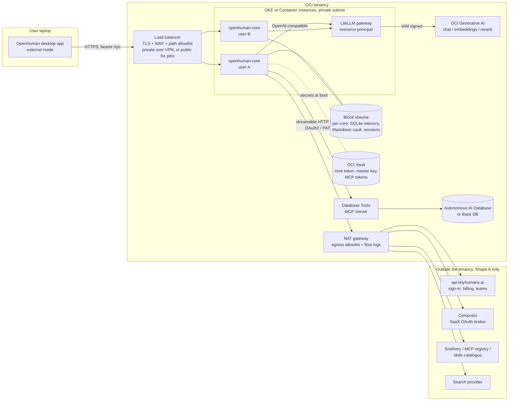

# OpenHuman on OCI: reference architecture

Status: living document. Based on OpenHuman docs and source as of v0.64.x (October 2026). The deployed pilot and its findings are in [`PILOT.md`](PILOT.md).

## 0. User stories

The core story, and the only reason to run the core anywhere but a laptop:

> As an OpenHuman user, I want my assistant to keep working when my laptop is
> closed, so that auto-fetch keeps pulling my data every twenty minutes,
> scheduled workflows run, and it answers me on Telegram, Slack or email at any
> hour.

The two clauses that make it an OCI story rather than a hosting story:

> ... and my prompts and memory embeddings go to models in a cloud I already pay
> for and trust, not through the vendor's inference proxy.

> ... and it can answer questions about data in my Oracle Database, using the
> database's own access controls, without me writing SQL or copying data out.

If neither clause matters to the person deploying, use the upstream Fly or
DigitalOcean recipe instead.

## 1. The first decision: which unit to deploy

OpenHuman is a single-user desktop product with a headless core. There are two
credible ways to put it on OCI, and everything else follows from the choice.

### Shape A: personal core in your tenancy

Run the published `ghcr.io/tinyhumansai/openhuman-core` container, one instance
per user, on OKE or OCI Container Instances. The desktop app connects in external
mode (`OPENHUMAN_CORE_RUN_MODE=external`) over a private path. Inference is BYOK
to OCI Generative AI. Databases are reached through Oracle's managed MCP servers.

Pros: fast to stand up; matches the upstream DigitalOcean / Fly recipes; keeps
the full feature set including the 118+ SaaS integrations.

Cons: the core still requires `BACKEND_URL` to reach `api.tinyhumans.ai` for
sign-in, billing and teams. SaaS integrations run through Composio, a third-party
broker that holds the OAuth tokens. Single bearer token per core, no per-user
isolation inside one core.

### Shape B: sovereign

Build a thin Rust service on the `openhuman-embed` crate (plus `openhuman-rpc`
contracts for the wire format). The docs state the base embed crate makes no
TinyHumans connection: agents, memory, skills, tools and RPC all run in-process.

Pros: nothing leaves the tenancy except what you route out. This is the shape an
enterprise security review will accept.

Cons: you lose Composio integrations, hosted voice / speech-to-text, teams and
billing. You own the serving layer and auth. The upstream UI is not shipped as a
production web app yet, so clients are the desktop app in external mode, the
TUI, or your own front end.

### Recommendation

Build the reference architecture as Shape A now. Keep every OCI component
identical for both shapes so the move to B is a container image swap, not a
redesign. Treat B as the enterprise target.

The pilot that was actually built from this design, with its decisions and
results, is in [`PILOT.md`](PILOT.md).

## 2. Component mapping

*As built in the pilot (Shape A); the design alternatives follow.*


```
                 ┌──────────────────────── OCI tenancy ─────────────────────────┐
                 │                                                               │
 Desktop app ────┼─ Load balancer (TLS, WAF,  ──► openhuman-core (per user)      │
 (external mode) │   path allowlist /rpc,/health)                                │
                 │                                 │  workspace: Block Volume    │
                 │                                 │  secrets: OCI Vault         │
                 │                                 ├──► LiteLLM gateway ──► OCI GenAI
                 │                                 │    (resource principal)  chat / embed / rerank
                 │                                 ├──► Database Tools MCP Server ──► ADB / Base DB
                 │                                 │    (OAuth2 via IAM Identity Domains)
                 │                                 └──► NAT gateway (egress allowlist)
                 │                                        │
                 └────────────────────────────────────────┼────────────────────┘
                                                          ▼
                       api.tinyhumans.ai (auth/billing)  Composio  Smithery  search provider
```

Rendered view (GitHub renders this block):



### 2.1 Compute

| Option | When |
| --- | --- |
| OKE, one Deployment per user, PVC on Block Volume | Default. Many users, GitOps, External Secrets Operator for Vault |
| OCI Container Instances, one per user | Simplest for a pilot of a handful of users |
| Compute VM + systemd, standalone binary | Ampere A1 (upstream images are amd64 only, so build from source) |

Upstream sizing claim: a minimal build is a ~60 MiB stripped binary and hosts
hundreds of agents on 2 vCPU / 2 GB. No GPU is required unless you run a local
embedding model (see 2.2).

### 2.2 Inference: OCI Generative AI

OCI GenAI exposes an OpenAI-compatible surface at
`https://inference.generativeai.<region>.oci.oraclecloud.com/openai/v1`
(chat completions, responses, conversations, files, vector stores, containers),
authenticated with either GenAI API keys (`Authorization: Bearer sk-...`) or OCI
IAM request signing.

OpenHuman accepts a custom OpenAI-compatible provider registered under your own
slug, and assigns providers per workload hint (`hint:reasoning`, `hint:fast`,
`hint:vision`, `hint:summarize`, `hint:code`, `hint:burst`) in `config.toml`.

Two gaps make a gateway worthwhile:

1. **Embeddings and rerank are not on the OpenAI-compatible endpoint.** They are
   only on the OCI-native API. OpenHuman's memory tree needs an embeddings
   provider (OpenAI, Voyage, Cohere, Ollama or custom OpenAI-compatible).
2. **Static API keys.** OCI positions API keys for development and IAM for
   production. OpenHuman can only send a bearer.

Recommended: run a LiteLLM proxy in-tenancy with resource-principal or instance-
principal signing in front of OCI GenAI. OpenHuman then sees one OpenAI-
compatible base URL and one slug for chat, embeddings and rerank, and no OCI
credential ever lives in the OpenHuman workspace. Alternative for embeddings
only: an Ollama sidecar serving `bge-m3`, which the upstream docs call out as the
recommended local embedder.

Suggested initial routing (adjust to the catalogue in your region):

| Hint | Model family |
| --- | --- |
| reasoning | gpt-5.x or grok-4 via OCI GenAI |
| fast, burst | llama-3.3-70b-instruct or gpt-oss-120b |
| vision | llama-4-scout-17b-16e-instruct |
| summarize | cohere command-a or a fast tier |
| embeddings | cohere.embed-v4.0 or embed-multilingual-v3.0 |

### 2.3 Oracle Database access for agents

Three Oracle-native MCP options. OpenHuman's `mcp.json` accepts stdio servers
and remote servers as `{ url, headers }` over streamable HTTP.

| Server | Transport | Auth | Use |
| --- | --- | --- | --- |
| **OCI Database Tools MCP Server** (managed, serverless) | streamable HTTP | OAuth 2.0 via IAM Identity Domains, or personal access tokens; server runs as a resource principal to reach Database Tools connections and Vault wallets | **Default.** Zero cost, IAM RBAC, works with ADB, Base DB and on-prem via private endpoint |
| **ORDS `/mcp` endpoint** | streaming HTTPS | OAuth2 / JWT | Shops that already run ORDS |
| **SQLcl MCP Server** | stdio | saved SQLcl connections | Dev only. Needs Java and a wallet inside the container |

Identity caveat: one core token means every SQL statement runs under one
database identity. Per-user OAuth on the Database Tools MCP Server only helps if
each user has their own core. This is another reason for the per-user shape.
Run DB-facing agents at the `readonly` or `supervised` access tier so writes
pause for approval.

Verify before relying on it: whether OpenHuman's remote MCP client can complete
an OAuth authorization-code flow headlessly, or only send static headers. If
only headers, use a personal access token from the Identity Domain and rotate it
through Vault.

### 2.4 Memory and storage

Memory is SQLite (`<workspace>/memory_tree/chunks.db`, FTS5 plus embeddings),
the Markdown vault (`<workspace>/wiki/`), session DBs and agent skills, all under
the workspace directory. Upstream applies AES-256-GCM at rest keyed by Argon2id.

| Concern | OCI answer |
| --- | --- |
| Persistence | One Block Volume (or File Storage export) per core, with a backup policy |
| Encryption key | Seed the master key from OCI Vault at boot; headless Linux has no OS keychain, so OpenHuman falls back to an encrypted file |
| Oracle AI Database as the memory store | Possible but partial. `tinymemory` admits external drivers (Supermemory, Mem0, Cognee, AgentMemory via REST) and ships a conformance suite. An Oracle AI Database 26ai driver (vector search plus Oracle Text for hybrid recall) is a bounded project. The Memory Tree chunk pipeline stays on local SQLite regardless, and the docs call the REST backend "not the recommended extension point". Phase 2, and do not promise "memory lives in Oracle DB" without a fork |

### 2.5 Secrets

| Secret | Where |
| --- | --- |
| `OPENHUMAN_CORE_TOKEN` (full control of the core) | OCI Vault, injected as an env var; rotate on schedule |
| `OPENHUMAN_BACKEND_API_KEY` (Shape A only) | OCI Vault |
| GenAI API key (only if no gateway) | OCI Vault, two-secret rotation |
| MCP personal access tokens | OCI Vault |
| Memory master key | OCI Vault |

OKE: External Secrets Operator with the OCI Vault provider. Container Instances:
Vault secret references in the environment.

### 2.6 Network and client access

The core binds `0.0.0.0:7788`. `/rpc` requires the bearer token. `/health`,
`/events` and `/ws/dictation` are unauthenticated in the current build, and the
events stream carries agent activity. The core itself never gets a public IP.

| Deployment | Client path |
| --- | --- |
| Pilot, users outside a corporate network | Public OCI Load Balancer with TLS, a WAF rate-limit rule on `/rpc`, and a **path allowlist that forwards only `/rpc` and `/health`**. The allowlist closes the unauthenticated streams without an upstream code change. Dictation over the network is lost; use the desktop app's local dictation instead |
| Oracle internal | Private OCI Load Balancer reached over the corporate VPN or FastConnect. Nothing public |
| Admin / break-glass | OCI Bastion port-forward to the nodes or pods. Not the daily client path: sessions expire after three hours and need SSH |

Network Security Group on the core: inbound 7788 only from the load balancer
subnet. Rotate the bearer token on a schedule and after any suspected leak.

### 2.7 Egress governance (Shape A)

Route through a NAT gateway with an allowlist and log flows. Expected
destinations:

| Destination | Why | Shape B |
| --- | --- | --- |
| `api.tinyhumans.ai` | sign-in, billing, teams | removed |
| Composio | OAuth brokering and tool proxying for SaaS integrations | removed |
| Smithery and official MCP registry, skills catalogue | fetched at startup and cached hourly | optional |
| Search provider (Exa, Brave, Tavily or self-hosted SearXNG) | web search | your choice |
| OCI GenAI (via gateway) | inference | stays |

Verify with VCN flow logs that BYOK chat really goes to OCI GenAI and not through
the TinyHumans inference proxy.

### 2.8 Tool sandboxing

Upstream sandboxes tool execution with Landlock, Bubblewrap, Firejail or Docker.
Nested sandboxing inside a pod is awkward. Options: run the pod with the
minimum privileges Landlock needs, or set the sandbox to policy-only and let
the pod be the boundary while keeping DB-facing agents at `readonly` /
`supervised`.

## 3. Things to be honest about

- The project is weeks old at this scale and moves fast (dozens of merges per
  day). Pin image tags.
- The headless core is explicitly single-user with no per-user isolation.
- Upstream images are amd64 only.
- GPL-3.0: fine for internal deployment; redistributing a modified core, or
  embedding it in a product you ship, triggers copyleft obligations.
- Speech-to-text has no self-hosted path upstream. Web search needs your own
  provider key or SearXNG.

## 4. Phased plan

| Phase | Deliverable |
| --- | --- |
| 0 | This document reviewed. Decide pilot shape (A) and target compute (OKE vs Container Instances) |
| 1 | Terraform / Resource Manager stack: VCN, private subnets, NAT with allowlist, load balancer with path allowlist, OKE or Container Instances, Block Volume per core, Vault, LiteLLM gateway with resource principal to OCI GenAI, Database Tools MCP Server over an ADB with a Database Tools connection and Vault wallet |
| 1 demo | Desktop app in external mode. Prompt: "what changed in the ORDERS table this week, and remember the summary". Agent calls MCP run-sql, writes to memory, result visible in the Obsidian vault |
| 2 | Upstream contributions (see `UPSTREAM.md`): OCI deploy recipe, `oci` provider preset, Oracle AI Database memory driver |
| 3 | Shape B: embed-based service, own auth, no TinyHumans transport |
