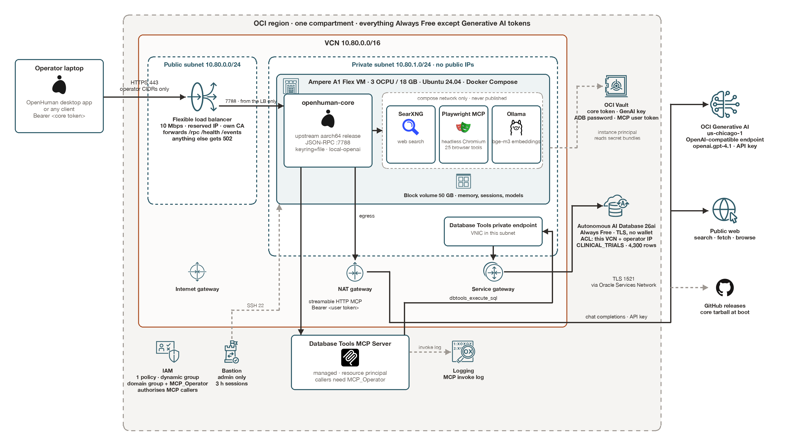
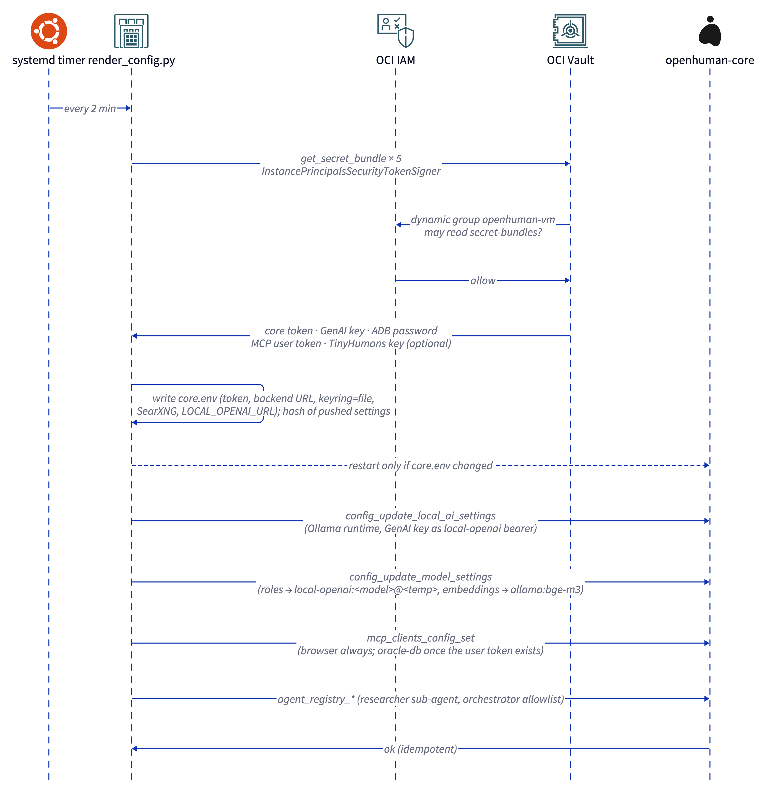
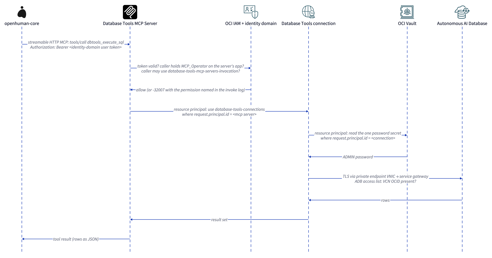
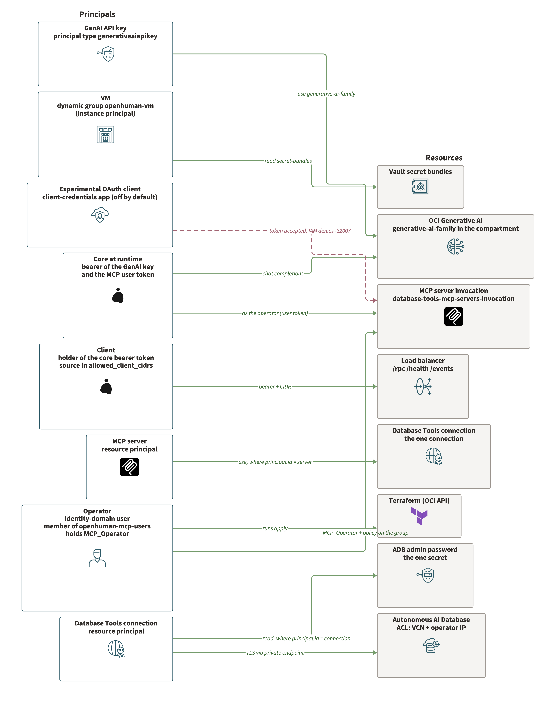
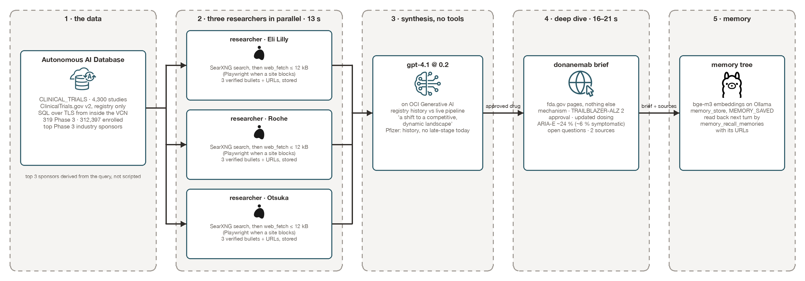

# OpenHuman on Oracle Cloud: a governed personal AI agent with no vendor account

*By Federico Kamelhar, Senior Principal Architect, Agentic AI — Oracle*

*Architecture reference, version 1.1, October 2026. Companion repository: [github.com/kamelhar/openhuman-oci](https://github.com/kamelhar/openhuman-oci). The design space this pilot was narrowed from, with the alternatives and the target shape, is in [`ARCHITECTURE.md`](ARCHITECTURE.md); the day-by-day notes are in [`PILOT.md`](PILOT.md).*

*Revision history. 1.0, 2026-10-02: first complete draft after the two recorded sessions. 1.1, 2026-10-02: figures redrawn with Oracle's icon set and the products' own logos; upstream merges recorded; keyring made release-ready; prerequisites, decisions and failure modes added.*

---

## Executive summary

[OpenHuman](https://github.com/tinyhumansai/openhuman) is the open-source personal AI agent that reached about 40,000 GitHub stars in its first year: a Rust core that builds a local memory of a person's work, orchestrates fleets of agents on durable graphs, and researches across the web and more than a hundred integrations. It ships as a desktop app, and its headless core is normally hosted on a laptop or a generic VPS behind the vendor's cloud.

This document describes how we ran that core on Oracle Cloud Infrastructure (OCI) with three properties the upstream project does not offer out of the box:

1. **No vendor account.** Inference comes from [OCI Generative AI](https://docs.oracle.com/en-us/iaas/Content/generative-ai/home.htm) through its OpenAI-compatible endpoint, wired into the core as a caller-owned runtime. The TinyHumans sign-in that gates custom providers is never touched.
2. **Governed access to Oracle Database.** Agents reach data only through the managed [Database Tools MCP Server](https://docs.oracle.com/en-us/iaas/database-tools/doc/working-database-tools-mcp-server.html), under OCI Identity and Access Management (IAM) policy and identity-domain application roles. No wallet, no connection string, no SQL driver inside the agent.
3. **Everything else on Always Free.** One Ampere A1 virtual machine, one Autonomous AI Database, one flexible load balancer, a Vault, a Bastion, a log group: all within OCI's Always Free allowances. The only metered cost is Generative AI tokens.

Everything is expressed in Terraform (58 resources in one root module) plus a boot script on the VM; `terraform apply` builds it in about twenty minutes and `terraform destroy` removes it, compartment included. The deployment was validated end to end on 2026-10-01 and 2026-10-02 against a personal pay-as-you-go tenancy, and two recorded sessions show it working: a 132-second tour of the platform and a 145-second clinical-research scenario in which the agent analyses 4,300 public Alzheimer's disease trials in the database, researches the leading sponsors on the live web with parallel sub-agents, writes a sourced brief on an approved drug from FDA pages, and reads it back from memory.

The work also produced nine upstream findings, filed as five issues and five pull requests on the OpenHuman repository; three of the pull requests were merged the same day. The effort is worth it because the pattern is harness-neutral: swap OpenHuman for any OpenAI-compatible agent harness that speaks the Model Context Protocol (MCP) and the OCI side does not change.

---



*Figure 1. The deployed pilot, drawn with Oracle's architecture-diagram icon set. The laptop reaches only the load balancer; the core has no public IP and pulls every secret from Vault with its instance principal; agents reach the database only through the managed MCP server, whose own connection goes through a private endpoint and the service gateway. A plain-text rendering for terminals lives in `media/architecture.txt`.*

---

## 1. The problem this solves

An engineer whose company runs on Oracle Database wants a personal AI agent that works across their own notes, mail and code **and** answers questions from the company's data in plain language, keeps working when the laptop is closed, and does all of it inside the company's cloud with database access governed by the roles the company already manages. Today that person has three bad options: paste company data into a public chatbot, run a SQL chatbot with no personal context, or build an agent platform from scratch.

OpenHuman is the right starting point for the "personal agent" half: a persistent memory, durable multi-agent orchestration, web research, and a headless core that runs anywhere. It is the wrong fit, unmodified, for the "inside our cloud" half: the headless core expects the vendor's backend for sign-in and inference, its SaaS integrations run through a third-party OAuth broker, and nothing in it knows how to reach an Oracle Database without a wallet.

The architecture below closes that gap without forking OpenHuman. Every adaptation is either configuration the core already supports, a container placed next to it, or an OCI service in front of it. Where the core genuinely lacked a capability, we documented the gap and filed it upstream rather than patching around it in a private build.

**Definition of done**, and the state at the time of writing:

| Criterion | Status |
| --- | --- |
| Inference never leaves our cloud | Done. OCI Generative AI via the OpenAI-compatible endpoint; verified by egress and by the core's provider log |
| No third-party account required | Done. Session-free `local-openai` mode; a chat turn answers in 1.7 s with no TinyHumans credential present |
| Agents reach Oracle data only through governed access | Built: managed MCP server, IAM policy, app role grant. Awaiting the operator's personal access token in Vault |
| Answers are remembered | Done. Memory tree with local embeddings; stored briefs read back across turns |
| Always on | Done. Headless core on an Always Free VM, restarted by Compose, reconfigured by a timer |
| One command to build, one to tear down | Done. `terraform apply` / `terraform destroy` |
| Fits a personal account | Done. Every resource Always Free except Generative AI tokens |

Two supporting stories ride on the same stack: a platform engineer who wants one governed way for *any* agent harness to reach Oracle Database, and an advocate who needs a live, reproducible demonstration of OCI as an agent platform.

---

## 2. Design principles

**Governed by default.** Every hop has an identity and a policy: the client has a bearer token and a source CIDR; the VM has an instance principal that may only read secret bundles; the MCP server has a resource principal that may only use one connection; the connection may only read one secret; the GenAI API key is authorised by a policy on its principal type; the database accepts connections only from the VCN and the operator's address. There is no step where a credential sits in a file a human could copy out of a container.

**Sovereign where it matters.** Prompts, tool results, memory and the database never leave the tenancy. What does leave is enumerated in section 4 and goes through one NAT gateway: the regional Generative AI endpoint, the public web the agent researches, the release download and catalogue refreshes at boot, and the vendor's backend URL, which is reachable but carries no credential and does no inference here.

**Free to run, cheap to prove.** The architecture had to fit a personal account so that anyone can reproduce it. Always Free constraints were a forcing function for good decisions: one VM instead of a cluster, containers instead of services, a Vault-fed keyring instead of a secret daemon.

**Reproducible from a clean tenancy.** Terraform owns every resource. The two things Terraform cannot do today, minting a Generative AI API key and generating a personal access token in the identity domain, are scripted or documented as single steps, and the VM reconciles its own configuration from Vault every two minutes so order of operations does not matter.

**Harness-neutral.** OpenHuman-specific logic lives in one directory of VM assets. The network, identity, secrets, inference and database layers assume only an OpenAI-compatible client that speaks streamable-HTTP MCP.

**Upstream over fork.** Every workaround points at an upstream issue that would retire it.

### 2.1 Decisions, and the alternatives they displaced

*Table 0. Where the design could have gone another way.*

| Decision | Chosen | Not chosen | Why |
| --- | --- | --- | --- |
| Compute unit | One Ampere A1 VM with Docker Compose | OKE, Container Instances | OKE worker nodes draw on the same A1 allowance and Container Instances are not Always Free; one VM keeps the pilot free and legible. OKE is the phase-three shape |
| Core binary | Upstream release tarball on Ubuntu 24.04 | Upstream container image, source build | The image is amd64 only; Debian bookworm's glibc is too old for the aarch64 tarball; a source build needs the Rust toolchain on a 3-OCPU VM |
| Inference route | `local-openai` runtime pointed at OCI Generative AI | Native custom cloud provider (`byok-cloud`), in-tenancy gateway | The native route is gated behind a TinyHumans session; the gateway cannot sign with an instance principal today, so it would have reintroduced a user key; the API key is itself a policy-governed principal |
| Embeddings | `bge-m3` on Ollama, on the VM | Cohere embeddings on OCI Generative AI | Embeddings and rerank are native-API only, unreachable by an OpenAI-compatible client; local embeddings cost nothing and keep memory in-tenancy |
| Edge | Public flexible load balancer, path route set, empty default backend set | OCI WAF rules, private load balancer over VPN, Bastion as the client path | `ALLOW` rule sets cannot match paths; a WAF is more than one operator needs and is not Always Free; the private load balancer is the corporate-network shape; Bastion's three-hour sessions make it an admin tool |
| Database access | Managed Database Tools MCP Server, personal access token | Client-credentials OAuth app, SQLcl MCP in the container, ORDS | Client-credentials tokens are accepted but cannot be authorised by IAM; SQLcl needs Java and a wallet inside the agent; ORDS is another deployment |
| Database connectivity | One-way TLS, access list of VCN plus operator address, private endpoint | mTLS wallet | No wallet file anywhere; the private endpoint and service gateway let the access list recognise the VCN |
| Secrets delivery | Timer-driven renderer using the instance principal | Secrets in cloud-init, baked into the image, Terraform provisioners | Nothing secret at creation; reconciliation makes order of operations irrelevant and absorbs the two secrets Terraform cannot mint |
| Search | SearXNG container | Exa, Brave or Tavily keys | No vendor key, no account, in-tenancy |
| Browser | Playwright MCP container, isolated profile | The core's built-in browser tools | The built-in tools bind to the desktop shell's embedded Chromium |
| Keyring | `auto`: file on 0.64.10, `encrypted_file` with a Vault master key afterwards | Always the file keyring | The release gate lets the same Terraform serve both releases without an operator decision |

---

## 3. Architecture overview

The deployment has six planes. Table 1 maps each to its OCI services and to the Terraform that creates it.

*Table 1. Planes, services and Terraform.*

| Plane | OCI services | Terraform objects (module `deploy/terraform`) |
| --- | --- | --- |
| Client and edge | Flexible Load Balancer (10 Mbps), reserved public IP, generated CA and leaf certificate, three network security groups | `lb.tf`, `security.tf`: 1 LB, 2 backend sets, 1 listener, 1 path route set, 1 certificate, 1 backend, 1 reserved IP, 3 NSGs with 6 rules |
| Network | VCN, public and private regional subnets, internet gateway, NAT gateway, service gateway, two route tables, one closed security list | `network.tf`: 11 objects |
| Compute and runtime | Ampere A1 Flex VM (3 OCPU, 18 GB), Ubuntu 24.04 aarch64, 50 GB boot volume, 50 GB block volume, cloud-init | `compute.tf`: instance, volume, attachment, image lookup |
| Inference | OCI Generative AI in us-chicago-1, API key authorised by IAM policy | `identity.tf` (policy statement), `deploy/scripts/01-genai-api-key.sh` (key) |
| Data | Autonomous AI Database 26ai (Always Free), Database Tools private endpoint, connection, managed MCP Server | `database.tf`, `dbtools.tf`, `mcp_roles.tf` |
| Identity and secrets | Compartment, identity-domain group and app-role grant, dynamic group, one policy, Vault with software key and six secrets | `compartment.tf`, `identity.tf`, `vault.tf` |
| Operations | Bastion, log group with the MCP invoke service log | `bastion.tf`, `logging.tf` |

The Terraform state holds 65 entries: 58 managed resources and 7 data sources. A full apply from an empty compartment takes about twenty minutes, dominated by the Autonomous Database (about three minutes), the load balancer (about four) and the Database Tools private endpoint (about six).

### 3.1 Request flows

Three flows define the system. Each is drawn as the sequence of principals and checks a request passes.

**Flow A, a chat turn from the laptop.**


*Figure 2a. Flow A: a chat turn. The load balancer admits the request by source CIDR and path, the core checks its bearer token, and the model call goes to OCI Generative AI under the API key's own IAM policy. Tool calls arrive as text and are parsed by the harness.*

**Flow B, the VM reconciling its configuration.**



*Figure 2b. Flow B: the VM reconciles itself every two minutes. Secrets come from Vault through the instance principal; settings and MCP registrations are pushed through the core's own RPC so that order of operations never matters.*

**Flow C, an agent reaching the database.**



*Figure 2c. Flow C: an agent reaches Oracle Database. Four principals each hold one permission; the agent holds none of the database's.*

---

## 4. Edge and client access

The core binds all interfaces on port 7788 and exposes four paths: `/rpc` (bearer-protected JSON-RPC), `/health`, `/events` (server-sent events) and `/ws/dictation`. In the upstream build only `/rpc` checks the token; the two streams and the health probe are open. That makes the edge the control.

**Load balancer.** A public flexible load balancer with a 10 Mbps floor and ceiling (the Always Free shape), a reserved public IP created before the certificate so the certificate can carry the address as a subject alternative name, and TLS terminated with a locally generated CA. The listener is HTTP on 443 with TLS 1.2 and 1.3 only.

**Path allowlist.** OCI load balancers cannot use `PATH` conditions in `ALLOW` rule sets; the first apply failed on exactly that with `400 InvalidParameter, Unsupported rule conditions found`. The working construct is a *path route set* that sends `/rpc`, `/health` and `/events` to the `core` backend set and leaves the listener's default backend set, named `blackhole`, with no backends. Anything else gets a 502 from the load balancer and never reaches the VM. Measured behaviour:

| Request | Result |
| --- | --- |
| `GET /health` | 200, core health JSON |
| `POST /rpc` without a token | 401 |
| `POST /rpc` with the token | 200, method result |
| `GET /ws/dictation` or any other path | 502 from the empty backend set |

**Network security groups.** Three: the load balancer's (ingress 443 only from `allowed_client_cidrs`, egress 7788 only to the core's group), the core's (ingress 7788 only from the load balancer's group, 22 only from inside the private subnet for the bastion, all egress), and the Database Tools private endpoint's (egress only). The subnets' security lists allow nothing inbound, so the groups are the whole story.

**Egress.** The private route table sends `0.0.0.0/0` to the NAT gateway and the Oracle Services Network to the service gateway. What leaves the tenancy from the core in this shape: the OCI Generative AI endpoint in Chicago (via NAT; the service gateway is regional), GitHub releases at boot for the core binary, the Smithery and skills catalogues the core refreshes at start, the public web the agent researches, and the vendor's backend URL, which the core expects to be set and probes but which carries no credential and does no inference here.

**Two egress surprises worth knowing.** On the corporate laptop used for the pilot, HTTPS and SSH left through different public addresses. The bastion closed sessions right after authentication until its allowlist was widened, and the database refused the laptop's driver connections with `ORA-12506` while the load balancer accepted its HTTPS. A separate `bastion_client_cidrs` variable exists for that case, and the database is seeded from inside the VCN instead. The second surprise: the corporate secure web gateway re-signs TLS for some destinations by server name; connecting to the load balancer by IP avoided it.

**Bastion.** OCI Bastion is admin-only: port-forwarding sessions to the VM's private address, three-hour lifetime, key-bound. It is not the client path, which is why the load balancer exists at all.

---

## 5. Compute and runtime

### 5.1 The VM

One `VM.Standard.A1.Flex` instance, 3 OCPU and 18 GB of the 4 OCPU / 24 GB Always Free allowance (the remainder was already in use in the tenancy), Canonical Ubuntu 24.04 aarch64, in the private subnet with no public IP, a 50 GB boot volume and a 50 GB paravirtualised block volume mounted at `/opt/openhuman/data` for everything stateful. Memory, sessions, the Markdown vault, Ollama's models and the browser's output live there and survive instance replacement.

Cloud-init writes one environment file with non-secret settings (secret OCIDs, region, model, mode, asset URL) and runs `bootstrap.sh`, which the VM downloads from the repository's `main` branch. That is deliberate: the VM assets are versioned with the Terraform, and a change to them is a `git push` followed by a reboot or a re-run of the script, never a rebuild of the VM.

### 5.2 Containers

Docker Compose runs four services on an internal network; only the core publishes a port.

*Table 2. Containers on the VM.*

| Service | Image | Role | Limits |
| --- | --- | --- | --- |
| `openhuman-core` | Built on the VM: `ubuntu:24.04` plus the upstream release tarball `openhuman-core-0.64.10-aarch64-unknown-linux-gnu.tar.gz` and upstream's own entrypoint script | The agent runtime, JSON-RPC on 7788 | 2 CPU, 6 GB, read-only root, `cap_drop ALL` plus the three capabilities the entrypoint needs |
| `ollama` | `ollama/ollama` | `bge-m3` embeddings (1,024 dimensions) for the memory tree | 1 CPU, 6 GB |
| `searxng` | `searxng/searxng` | Web search with JSON output enabled; the core's search role resolves to it | 0.5 CPU, 1 GB |
| `playwright-mcp` | `mcr.microsoft.com/playwright/mcp` | Headless Chromium exposed as an MCP server over streamable HTTP; 25 `browser_*` tools; `--isolated`, viewport 1280x800, screenshots to the shared output volume | 1 CPU, 2 GB, 1 GB shared memory |

Two choices here came from failures.

**glibc.** Upstream publishes a prebuilt aarch64 core with every release, which removes the need for a Rust build. That binary is linked against glibc 2.39. The runtime stage of upstream's own Dockerfile is Debian bookworm, whose glibc is 2.36; wrapping the tarball in it dies at exec with `GLIBC_2.39 not found`. The x86_64 tarball needs only 2.34. Ubuntu 24.04 is the base here, and the fact is now in upstream's deployment docs (PR #6929, merged 2026-10-02).

**Projects directory.** Upstream's compose file runs the container read-only and mounts only the workspace. The core creates `~/OpenHuman/projects` at start as its default action sandbox, which fails with `EROFS` and leaves file tools with no writable directory. A second volume at `/home/openhuman/OpenHuman` fixes it; that is PR #6928, merged upstream on 2026-10-02 and part of the next release after 0.64.10.

### 5.3 Secrets and configuration without an operator

The VM never receives a secret at creation. `render_config.py`, run by a systemd timer every two minutes, authenticates to Vault with the instance principal, reads the six secrets, writes the core's environment file, restarts the core only when that file changed, and then pushes the agent's settings through the core's own JSON-RPC. That last step exists because of a finding about the core.

**Headless keyring.** In production mode the core stores provider keys with an `encrypted_file` keyring whose master key it loads from the operating system keychain. A container has no keychain, the core logs `master key unavailable — cannot store secrets`, and the first settings write fails with `Failed to encrypt api_key`. Release 0.64.10 has no way to inject that master key, so on it the deployment runs `OPENHUMAN_KEYRING_BACKEND=file`, which keeps the provider key in a plaintext JSON file on the block volume (encrypted at rest by OCI, mode 0600, private subnet), and the VM is the secret boundary. Issue #6926 asked for an environment-variable master key and PR #6935 adds it (`OPENHUMAN_KEYRING_MASTER_KEY`, 64 hex characters, or `OPENHUMAN_KEYRING_MASTER_KEY_FILE`). The deployment is already built for it: Terraform generates a 32-byte master key into Vault, and the renderer switches to `encrypted_file` with that key on any release newer than 0.64.10, or when `keyring_backend = "encrypted_file"` is set. Upgrading is one variable change; the renderer re-pushes the provider keys after the switch, so nothing has to be migrated by hand.

**BYOK is completed by the core, not by a file.** Hand-writing an `inference_url` and `api_key` into the core's TOML does not route: the core only completes a custom-provider route (registers the provider, pins the roles) inside its settings-update RPC. The renderer therefore calls `openhuman.config_update_model_settings` and `openhuman.config_update_local_ai_settings` rather than editing TOML, and keeps a hash of what it pushed so the calls are idempotent.

---

## 6. Inference: OCI Generative AI as the only model provider

### 6.1 The endpoint and its authorisation

OCI Generative AI exposes an OpenAI-compatible surface at `https://inference.generativeai.<region>.oci.oraclecloud.com/openai/v1` with chat completions, the Responses and Conversations APIs, files, vector stores and containers. It authenticates either with OCI IAM request signing or with Generative AI API keys, bearer tokens created in the service and authorised by IAM policy. Terraform creates the policy first:

```
allow any-user to use generative-ai-family in compartment <c>
  where ALL {request.principal.type='generativeaiapikey'}
```

and a script mints the key with the CLI, because the Terraform provider has no resource for it yet. The create call requires an expiry per key and returns the secret only once (`.data.keys[0].key`); the script stores it straight into the Vault secret and never prints it. It creates two named keys with a one-year expiry so one can be rotated while the other serves.

Embeddings and rerank are **not** on the OpenAI-compatible path; they are native-API only. That is why embeddings run locally on Ollama in this shape. An in-tenancy gateway such as LiteLLM with resource-principal signing would put Cohere embeddings and rerank behind the same OpenAI-compatible URL, and is the reference design's recommendation for the OKE phase. It is not in the pilot because the gateway's proxy configuration cannot use instance principals, which would have reintroduced a user API key.

### 6.2 Getting inference without a TinyHumans session

This was the central discovery of the deployment. The headless core gates *custom cloud providers* behind an active backend session or a TinyHumans API key: without one, every turn fails with `SESSION_EXPIRED: backend session not active — sign in to use custom providers`. The gate lives in the provider factory's access checks, and it exempts one class of provider: caller-owned local runtimes (Ollama, LM Studio, MLX, OMLX and a generic `local-openai`).

The `local-openai` runtime takes its endpoint from the `LOCAL_OPENAI_URL` environment variable and its bearer from the local-AI settings' `api_key`. Pointed at OCI Generative AI, it is indistinguishable to the core from a server in the next room. The renderer sets:

- `LOCAL_OPENAI_URL=https://inference.generativeai.us-chicago-1.oci.oraclecloud.com/openai/v1` in the core's environment,
- the GenAI API key as `local_ai.api_key`, and
- every role (`chat`, `reasoning`, `agentic`, `coding`, `vision`, `memory`, `learning`) to `local-openai:openai.gpt-4.1@0.2`, with `embeddings_provider = ollama:bge-m3`.

The first chat turn through this route answered in 1.7 seconds with no TinyHumans credential anywhere in the system. A `byok-cloud` mode remains available in Terraform for operators who do have a TinyHumans API key and want the core's native cloud-provider path; it is off by default.

Upstream's own roadmap item for key-first onboarding (#6601) now carries this evidence as a comment, with the smallest change that would make the native BYOK path work in headless mode.

### 6.3 Models, measured

*Table 3. Models reachable with a Generative AI API key on the OpenAI-compatible endpoint, 2026-10-02.*

| Model id | Direct call | Through the core's `local-openai` route |
| --- | --- | --- |
| `openai.gpt-4.1` | 200 | Works; the pilot's model |
| `openai.gpt-5`, `openai.gpt-5.2`, `openai.gpt-5.4`, `openai.gpt-5.6-sol` | 200 | Fail: the runtime sends `max_tokens`, these models require `max_completion_tokens`, and the runtime's reasoning-model detection does not recognise the `openai.` prefix |
| `openai.gpt-5.1-chat-latest`, `xai.grok-4` | 404 on this endpoint | Not available |

The per-turn `model_override` parameter is ignored once roles are pinned to a local runtime, so model choice is a renderer setting, not a request parameter. Temperature is carried in the provider string (`@0.2`); lowering it measurably improved tool-protocol adherence.

### 6.4 The tool dialect, and why it matters for reliability

Every local runtime profile in the core is `PromptGuided`: the model receives tool schemas in the prompt and is expected to emit `<tool_call>{"name": …, "arguments": {…}}</tool_call>`; the harness parses that text. There is no native function-calling path without a TinyHumans session. Consequences observed over two days:

- A model that writes several tool calls in one message, or writes them in Python call syntax, sometimes has them returned as literal text instead of executed.
- Large fetched pages come back as a compression handle with a suggestion to call `juice_*` tools; the model then often mis-formats that call.
- OCI's endpoint caps `tool_call_id` at 64 characters and the harness mints 69 (`openhuman-session-<uuid>-model-N-tool-M`); four turns in one afternoon died with `string too long` (issue #6933).

The mitigations that worked are in section 10. The upstream fix would be either native tool calling for hosted OpenAI-compatible endpoints or an opt-in profile flag; both are listed as candidate contributions.

---

## 7. The research stack

OpenHuman's deep-research ability rests on search, page reading, browsing and memory. Without a vendor account the included search providers (Exa, Gemini) are unavailable, so the pilot provides each capability in-tenancy.

**Search.** SearXNG runs as a container with JSON output enabled; two environment variables (`OPENHUMAN_SEARXNG_ENABLED`, `OPENHUMAN_SEARXNG_BASE_URL`) make the core's search role resolve to it. The core's `tools_web_search` RPC returned Oracle documentation as its first citations with zero provider fallbacks.

**Page reading.** The built-in `web_fetch` converts HTML to Markdown through tinyjuice. Several news and blog sites return 403 to it; regulator and vendor documentation pages do not; the browser gets through where the fetcher does not.

**Browsing.** The core's own browser tools are bound to the desktop shell's embedded Chromium, so headless browsing comes from Playwright MCP, Microsoft's reference MCP server, run as a container and declared to the core as a remote MCP server. The core sees 25 tools: navigate, click, type, fill forms, snapshot, screenshot, evaluate, network, tabs. In the recorded session the agent navigated to oracle.com/mcp, took a screenshot (written to the shared output volume), snapshotted the accessibility tree and listed the seven MCP servers Oracle offers, correctly, in 11 to 16 seconds.

Two details about MCP tools in this core. They are *deferred*: not in the model's tool list until the model calls `tool_search`, which it does on its own for a prompt like "open X in the browser" and which an explicit first step guarantees. And the browser's cookie and country banners are real obstacles; dismissing one takes a snapshot to find the element reference and a click with the `target` parameter.

**Memory.** `memory_store` and `memory_recall` tools over the memory tree, with embeddings from Ollama's `bge-m3`. Stored briefs are listed back by the `memory_recall_memories` RPC with their URLs. The agent-side `memory_recall` tool returned empty for the same facts in every test, with or without a topic; the likely cause is that semantic recall needs embeddings the background indexer has not produced yet, and some background services stay deferred without a TinyHumans session. The demos therefore try the agent's recall first and fall back to reading the stored note through the RPC. It is an open question for upstream.

**Sub-agents.** The core ships an orchestrator with a fixed delegation allowlist (ten built-in agents). Registering a custom `researcher` agent through the registry works, and updating the orchestrator's `subagents.allowlist` through `agent_registry_update` persists, but the `spawn_async_subagent` tool's allowed ids are compiled from the default definition and never change, even after a restart (issue #6934; fix proposed in PR #6939). The team-coordination RPCs (`agent_team_*`) start a worker but expect the worker to claim and complete tasks on its own, which the researcher did not. The fan-out that works today runs one agent turn per topic in parallel from the client and synthesises in a fourth turn; it is honest about what it is and it is fast: three researchers in 13 to 14 seconds.

---

## 8. The data plane: Oracle Database through the managed MCP server

### 8.1 Why MCP and not a driver

The obvious way to give an agent a database is a connection string and a SQL tool. It is also the way wallets end up on laptops and in containers, and the way an agent's "read-only" promise rests on prompt text. Oracle's managed [Database Tools MCP Server](https://docs.oracle.com/en-us/iaas/database-tools/doc/working-database-tools-mcp-server.html) moves the credential and the policy out of the agent: the server holds a Database Tools *connection* whose password lives in Vault, runs with a resource principal, exposes `dbtools_execute_sql` over streamable HTTP, and admits callers by identity-domain application roles (`MCP_User`, `MCP_Operator`, `MCP_Administrator`) and IAM policy. Every call is a Database Tools invocation with a principal, which is why the service log can name the missing permission when one is denied.

### 8.2 The database and its network path

An Always Free Autonomous AI Database 26ai, OLTP, with mutual TLS disabled so that clients connect over one-way TLS without a wallet. OCI allows that only with an access control list, which here contains the VCN's OCID and the operator's address. A Database Tools *private endpoint* gives the Database Tools runtime a VNIC in the private subnet; its traffic to the database's public endpoint goes through the service gateway, which is what lets the ACL recognise the VCN. The connection is `ORACLE_DATABASE`, user `ADMIN` for the pilot, password by Vault secret id, `runtime_support = SUPPORTED`, `runtime_identity = RESOURCE_PRINCIPAL`.

### 8.3 The IAM layout

Oracle documents twelve policy layouts for MCP servers depending on runtime identities and authentication type. The pilot uses the resource-principal / resource-principal / password / compartment-scope layout:

```
allow group '<domain>'/'openhuman-mcp-users'
  to use database-tools-mcp-servers-invocation in compartment <c>
allow any-user to use database-tools-connections in compartment <c>
  where request.principal.id = '<mcp-server-ocid>'
allow any-user to read secret-bundles in compartment <c>
  where request.principal.id = '<connection-ocid>'
```

plus the identity-domain side: the MCP server registers itself as a resource-server application; Terraform grants that application's `MCP_Operator` role to the users group with an `oci_identity_domains_grant`. The user who will invoke the server is a member of the group.

### 8.4 Who can call it: a finding about client credentials

A headless core would ideally mint its own tokens. Terraform can create a confidential OAuth client in the identity domain with the client-credentials grant and the MCP server's scope (`urn:opc:dbtools:mcpserver:<ocid>mcp:all`), and the token endpoint issues a valid token with that audience. The MCP endpoint accepts the token and then returns `-32007 Missing required permissions`. The service log names it: `DATABASE_TOOLS_MCP_SERVER_INVOKE`, request principal type `user`, principal id the client's domain-app OCID.

No policy form authorised that principal: not `request.principal.id`, not `request.user.id`, not even an unconditional `allow any-user to use database-tools-mcp-servers-invocation in compartment <c>`. The caller is not a principal that IAM policy can match. Oracle's supported shapes are user tokens: a personal access token generated in the identity domain console for the MCP server's application, an OAuth sign-in through a registered public client, or a *trusted* client acting on behalf of a user with the JWT-bearer grant. The pilot uses a personal access token: the operator generates it once, a script stores it in Vault, and the renderer registers the database server in the core as soon as the secret stops being a placeholder. The experimental client stays in Terraform, disabled by default, for a future on-behalf-of attempt.

### 8.5 Observability

A log group with the Database Tools MCP server's `invoke` service log is part of the Terraform. It costs nothing at this volume and it is the only place a `-32007` turns into a permission name, a principal type and a principal id. Diagnosing the client-credentials finding above took one log record.

---

## 9. Identity and secrets model



*Figure 3. Every principal in the system and the one thing each may use. Green edges are granted by Terraform-managed policy; the dashed red edge is the client-credentials path that IAM cannot authorise today.*

*Table 4. Every principal in the system and what it may do.*

| Principal | Kind | Authorised to | Not authorised to |
| --- | --- | --- | --- |
| Operator | Identity-domain user, member of `openhuman-mcp-users`, holder of `MCP_Operator` | Invoke the MCP server; generate the personal access token; run Terraform | Nothing on the VM without a bastion session |
| Client | Whoever holds the core bearer token and sits in `allowed_client_cidrs` | Call `/rpc`, read `/health` and `/events` | Any other path (502), anything without the token (401) |
| VM | Dynamic group `openhuman-vm` (instances in the compartment) | Read secret bundles in the compartment | Write secrets, touch the database, call GenAI as itself |
| Core | Bearer of the GenAI API key and the MCP user token, read at runtime | Chat completions on OCI Generative AI; MCP invocations as the operator | Database connections, Vault |
| GenAI API key | `generativeaiapikey` principal | `generative-ai-family` in the compartment | Anything outside the compartment |
| MCP server | Resource principal | Use its one Database Tools connection | Read secrets directly |
| Database Tools connection | Resource principal | Read its one password secret | Anything else |
| Experimental OAuth client | Identity-domain confidential app (off by default) | Obtain a token for the MCP audience | Be authorised by IAM (see 8.4) |

*Table 5. Secrets in Vault and their lifecycle.*

| Secret | Created by | Consumed by | Rotation |
| --- | --- | --- | --- |
| Core bearer token | Terraform (`random_id`) | Client, renderer | Taint and apply, or update the secret; the renderer restarts the core |
| ADB admin password | Terraform (`random_password`) | Database Tools connection, seed script | Terraform |
| GenAI API key | `01-genai-api-key.sh` (placeholder from Terraform) | Renderer, then the core's `local-openai` bearer | Script creates a new key; revoke the old in the console |
| MCP user token | `03-register-mcp.sh` (placeholder from Terraform) | Renderer, then the core's `oracle-db` MCP header | Generate a new token, re-run the script |
| TinyHumans API key | Optional Terraform variable | Only in `byok-cloud` mode | Terraform |
| Keyring master key | Terraform (`random_id`, 64 hex) | The core's `encrypted_file` keyring on releases newer than 0.64.10 | Taint and apply; the renderer restarts the core and re-pushes the provider keys |

Terraform state contains the generated values and must be treated as a secret. Inside the core, provider keys sit in the file keyring on the encrypted block volume on release 0.64.10, and in the `encrypted_file` keyring under the Vault-held master key on every later release (issue #6926, PR #6935).

---

## 10. The clinical research use case, observed

The platform tour shows the plumbing. The second recorded session shows what the platform is for.

### 10.1 Data

A research analyst's question: where does Alzheimer's disease drug development stand, who is active, what has read out, what does it mean. The data is the public ClinicalTrials.gov registry, retrieved through its v2 API from inside the VCN and merged into a `CLINICAL_TRIALS` table in the Autonomous Database: 4,300 studies with identifiers, titles, phase, status, lead sponsor and sponsor class, enrollment, dates, conditions, interventions and site counts. Registry metadata only; no patient-level data exists in this system, by design and by policy.

*Table 6. The dataset at load (2026-10-02).*

| Slice | Count |
| --- | --- |
| Studies | 4,300, start dates 1981 to 2028 |
| Phase 3 | 319 trials, 312,397 enrolled, 36 recruiting |
| Phase 2 | 602 trials, 84,792 enrolled |
| Completed / recruiting / terminated | 2,284 / 626 / 318 |
| Top industry sponsors, all phases | Pfizer 62, Eli Lilly 59, Avid Radiopharmaceuticals 42, Merck 31, GSK 31 |
| Top industry sponsors, Phase 3 | Eli Lilly 20 (24,485 enrolled), Otsuka 14 (4,796), Roche 14 (90,268), Pfizer 14 (7,062), J&J 13 (7,493) |

### 10.2 The run



*Figure 4. The recorded session: the registry data in the database, three researcher turns in parallel, a tool-free synthesis, a regulator-only deep dive, and the brief read back from memory.*

Scene one queried the database over TLS from inside the VCN and derived the three sponsors to research from the result rather than from a script. Scene two started three researcher turns in parallel, each instructed to search, read two authoritative pages with a 12,000-byte cap, and return three verified bullets with URLs; all three returned in 13 seconds. Scene three asked the model, with no tools, to synthesise the notes against the table it had just seen.

The synthesis is the finding of the use case:

> *Historically, Alzheimer's trials have been few and slow-moving, with limited late-stage options. As of 2026, the pipeline is robust, with 36 drugs in Phase 3 and several sponsors, like Eli Lilly and Roche, advancing multiple candidates. This marks a shift to a more competitive and dynamic landscape, though not all major pharma (e.g., Otsuka) have near-term approval prospects.*

The database ranked Pfizer among the top historical sponsors; the web found no late-stage Pfizer programme today. Roche's trontinemab is in Phase 3 with a 2026 data readout; Otsuka's late-stage presence is unclear. A human analyst would value exactly that contrast between registered history and live pipeline, and no single source holds it.

Scene four was a deep dive on donanemab, Lilly's approved antibody, from regulator pages: mechanism, the TRAILBLAZER-ALZ 2 pivotal trial, FDA approval with the updated dosing schedule, ARIA-E in about 24 percent of treated patients with about 6 percent symptomatic, open questions on patient selection and APOE4 carriers, two fda.gov sources, and a `MEMORY_SAVED` confirmation, in 16 to 21 seconds. Scene five read the brief back from the memory tree.

What the governed path adds once the operator's token is in Vault: scene one becomes the agent's own `dbtools_execute_sql` calls under the operator's identity, which is the only part of the story that is Oracle-specific and the part that makes it enterprise-grade.

### 10.3 Reliability, measured

*Table 7. Success rates on the prompt-guided dialect, gpt-4.1, temperature 0.2.*

| Task | Attempts | Successes | Typical time | Dominant failure |
| --- | --- | --- | --- | --- |
| Browser: load tools, navigate, snapshot, list servers | 3 | 2 | 11 to 16 s | Textual call leaked instead of executed |
| Research: search, fetch two pages, store memory, brief | 3 | 3 | 5 to 9 s | None |
| Deep dive with unbounded fetches | 2 | 0 | 21 s | `juice_summarize` call mis-formatted after a large page |
| Deep dive with 12,000-byte fetches and one call per message | 2 | 2 | 16 to 20 s | None |
| Three parallel researchers from the client | 2 | 2 | 13 to 14 s | None |
| Orchestrator spawning a custom sub-agent | 4 | 0 | 2 to 4 s | Enum compiled from defaults (#6934) |

The recipe that moved the deep dive from zero to two of two:

1. One tool call per message; wait for its result before the next.
2. `web_fetch` with `max_bytes 12000`, and an explicit "never call juice_* tools".
3. Numbered steps, explicit tool names and arguments, a fixed output shape.
4. Regulator and official pages first; the browser when a site blocks the fetcher.
5. One silent retry on a missing marker, because of the id-length cap on OCI.

The demo driver encodes all five. The full prompt set is in the repository.

---

## 11. Security posture

**Exposed.** One load balancer on 443 to the operator's CIDRs. Three paths forwarded; `/health` and `/events` are unauthenticated upstream and `/events` carries agent activity, so the CIDR list is the control and widening it to the world is the one thing the operations guide forbids.

**Not exposed.** The VM (no public IP), the database (VCN access list, private-endpoint path), SearXNG and the browser (compose network only; a browser that any client could drive is a proxy into the tenancy), Vault, the MCP server (public endpoint, but IAM plus app roles plus a user token).

**Residual risks, stated.** Provider keys in the plaintext file keyring on the VM while it runs release 0.64.10 (the next release moves them under the Vault-held master key automatically); the core token as a single credential for full control of one user's core; the browser is a general-purpose web client under the agent's control, which is why it runs `--isolated` and why the agent's sandbox tier for file and shell tools should stay at read-only or supervised for database-facing work; the agent's textual tool dialect, which can be steered by prompt injection in fetched pages, is screened by the core's prompt-injection scanner but is a reason to keep `tool_allowlist`s tight on sub-agents.

**Data classification.** The clinical dataset is public registry metadata. Protected health information must never enter this system; the use case was chosen to make that true structurally, not by instruction.

---

## 12. Cost and footprint

*Table 8. What the pilot consumes.*

| Resource | Allowance used | Monthly cost |
| --- | --- | --- |
| Ampere A1 VM 3 OCPU / 18 GB | 3 of 4 OCPU, 18 of 24 GB Always Free | 0 |
| Block storage 100 GB | 100 of 200 GB Always Free | 0 |
| Autonomous AI Database 26ai | 1 of 2 Always Free databases | 0 |
| Flexible load balancer 10 Mbps | the 1 Always Free LB | 0 |
| VCN, NAT, service gateway, Bastion, Vault (software key), logging at this volume | free | 0 |
| Database Tools MCP Server, private endpoint, connection | zero-cost service | 0 |
| OCI Generative AI, gpt-4.1 | metered per token; the only billed line | at list price, a demo day of about sixty agent turns stays in single-digit US dollars |

---

## 13. Operating the deployment

**Prerequisites.** A tenancy with an identity domain, because the MCP server's application roles live there, and an operator who is an identity-domain user. Unused Always Free allowance: 3 of the 4 Ampere A1 OCPUs and 18 of the 24 GB, one of the two Autonomous Databases, 100 of the 200 GB of block storage, the one flexible load balancer. A1 capacity in the home region is the usual stumbling block: an apply that fails with `Out of host capacity` is retried later or in another availability domain. Generative AI must be available in a subscribed region (us-chicago-1 in the pilot; the home region may differ). Terraform 1.5 or newer with the OCI provider 9.8, the OCI CLI with an API-key profile for the key-minting script, an SSH key for Bastion, and the operator's current public address for the allowlists, which on some corporate networks changes daily. The pilot was validated on a personal pay-as-you-go tenancy; the account check that preceded it is in `PILOT-ACCOUNT-VALIDATION.md`.

**Build.** `00-preflight.sh`; `terraform init && apply`; `01-genai-api-key.sh`; `02-trust-lb-cert.sh` on the client; generate the personal access token in the identity-domain console and `03-register-mcp.sh tokens.tok`; seed data from inside the VCN (`sql-vm.sh` or the seed script on the VM). A clean `terraform plan` is the acceptance test; three provider drifts (Always Free reporting zero cores, group schema extensions, the reserved IP's attachment) are silenced with documented `ignore_changes`.

**Verify.** `/health` 200 through the load balancer, `/rpc` 401 without the token, `openhuman.inference_agent_chat_simple` answering, the renderer's journal reporting model settings pushed and MCP servers registered.

**Upgrade the core.** Set `openhuman_version` to the new release (and `keyring_backend` only if you want to force a mode), apply, then on an existing VM edit `/opt/openhuman/bootstrap.env` to match (cloud-init changes are ignored on purpose) and re-run `bootstrap.sh`; it rebuilds the image from the new tarball and the renderer applies the keyring mode that release supports.

**Operate.** Bastion port-forward to the VM for logs (`/var/log/openhuman-bootstrap.log`, `docker logs openhuman-core`, `journalctl -u openhuman-render.service`); the renderer reconciles Vault changes within two minutes; a change to VM assets is a push to `main` plus a re-run of `bootstrap.sh`.

**Record.** `deploy/scripts/demo.sh` and `demo-research.sh` are the two scripted sessions; `vhs` records them, `media/assemble*.sh` cut the films. Pacing is a variable because a 45-second raw run is unreadable; the released films run at twice the natural pace with line-by-line reveals.

**Tear down.** `terraform destroy`; the compartment is created with `enable_delete`. The GenAI API key and the identity-domain token are outside state and are revoked in the console.

### 13.1 Failure modes and recovery

*Table 8b. What breaks, what it takes with it, and the way back.*

| Event | Effect | Recovery |
| --- | --- | --- |
| VM instance lost or replaced (host failure, `terraform taint`) | Core down; the block volume and everything on it survive | `terraform apply` recreates the instance; cloud-init re-runs the bootstrap; the renderer restores configuration within about five minutes (three after boot, then every two). Memory, sessions and models return with the volume |
| Block volume lost | Memory, sessions, Ollama model gone | The pilot has no backup policy; attach an OCI backup policy to the volume for anything beyond a demo |
| Always Free A1 instance reclaimed for idleness (OCI may reclaim instances whose CPU, network and memory all stay under 20 percent for seven days) | VM gone, volume intact | Re-apply. A pilot left idle for a week should expect it |
| Always Free Autonomous Database auto-stopped after seven days without connections, terminated after three months stopped | MCP SQL calls fail until the database starts; everything else runs | Start it from the console or CLI; the dataset survives a stop. A terminated database needs a re-apply and a re-seed |
| GenAI API key expires (one year by default) or is revoked | Every chat turn fails with 401 | Run `01-genai-api-key.sh` again; the Vault update reaches the core within two minutes |
| MCP personal access token expires | `oracle-db` MCP calls fail; the rest works | Generate a new token, run `03-register-mcp.sh` |
| Load balancer leaf certificate expires (one year; the CA three) | Clients reject TLS | `terraform apply` replaces it; set `early_renewal_hours` on the certificate to rotate ahead of time; re-run `02-trust-lb-cert.sh` only if the CA changed |
| Operator's public address changes | Connections to the load balancer time out; direct SQL is refused | Update `allowed_client_cidrs` and apply: seconds for the security group, about a minute for the database access list |
| Bastion session expires (three hours) | Admin SSH drops | Create a new session; the client path is unaffected |
| GitHub unreachable or the release removed at boot | Bootstrap cannot build the image on a new VM | Only boot fetches the tarball; running VMs are unaffected. Pin `openhuman_version` to a known release, or mirror the tarball to Object Storage |
| Search engines rate-limit the NAT address | Web search returns few results | SearXNG rotates across engines; add engines in `searxng-settings.yml` or a keyed provider |
| Generative AI regional outage, model retirement | Chat turns fail | Change `genai_chat_model` or `genai_region` and apply; on an existing VM edit `bootstrap.env` to match, because cloud-init changes are ignored; the renderer re-pins the roles within two minutes |
| Core crash loop | No answers; `/health` fails at the load balancer | Compose restarts it; the renderer waits for health before pushing settings; `docker logs openhuman-core` through Bastion names the cause |

---

## 14. Findings and upstream contributions

Everything the deployment found that belongs to OpenHuman rather than to this repository is filed where it can be fixed.

*Table 9. Upstream status, 2026-10-02.*

| Finding | Where | Status |
| --- | --- | --- |
| Compose `read_only` root leaves the agent projects directory uncreatable | [#6925](https://github.com/tinyhumansai/openhuman/issues/6925), PR [#6928](https://github.com/tinyhumansai/openhuman/pull/6928) | Merged 2026-10-02; in the next release after 0.64.10 |
| Docs: glibc floor of release tarballs, headless without an account, container keyring, OCI recipe | [#6927](https://github.com/tinyhumansai/openhuman/issues/6927), PR [#6929](https://github.com/tinyhumansai/openhuman/pull/6929) | Merged 2026-10-02 |
| Headless keyring master key cannot be injected | [#6926](https://github.com/tinyhumansai/openhuman/issues/6926), PR [#6935](https://github.com/tinyhumansai/openhuman/pull/6935) | PR open; the deployment already generates the key in Vault and switches on the first release after 0.64.10 |
| Tool-call ids exceed the 64-character cap OpenAI-compatible endpoints enforce | [#6933](https://github.com/tinyhumansai/openhuman/issues/6933) | Open; fix belongs in the tinyagents `CallId` |
| Orchestrator sub-agent allowlist update never reaches the spawn tool | [#6934](https://github.com/tinyhumansai/openhuman/issues/6934), PR [#6939](https://github.com/tinyhumansai/openhuman/pull/6939) | PR open |
| Custom cloud providers gated behind a session in headless mode | Comment on [#6601](https://github.com/tinyhumansai/openhuman/issues/6601) | Awaiting maintainers |
| `openai.`-prefixed reasoning models get `max_tokens` instead of `max_completion_tokens` | Not yet filed (tinyinference) | Reproduced |
| Agent `memory_recall` empty while the RPC lists the note | Not yet filed | Reproduced |
| OCI Generative AI provider preset and native embeddings | Not yet filed (tinyinference) | Planned after the above |

A tenth change, outside this list, fixed a test snapshot on upstream's main that was failing every outside contributor's CI run (PR #6937, merged the same day).

Licensing is not an obstacle in either direction: this repository is Apache-2.0, OpenHuman is GPL-3.0 and takes external pull requests without a CLA, and the repository downloads the upstream binary at deploy time rather than vendoring code.

---

## 15. What teams get, and what they can build

**For an individual engineer:** an always-on personal agent whose inference, memory and research run inside the company's cloud, with governed, role-based access to the Oracle data they already have, for the price of the tokens it uses.

**For a platform team:** one pattern for *any* agent harness to reach Oracle Database the governed way, with the identity, secrets, edge and observability layers already expressed in Terraform. The OpenHuman-specific part is one directory; LangChain, OpenShell, a Python agent or the next harness drops in behind the same load balancer and the same MCP server.

**For Oracle:** a reproducible, public demonstration that the newest pieces of the platform, the OpenAI-compatible endpoint with API keys, the managed Database Tools MCP Server, Autonomous AI Database 26ai on Always Free, compose into something an outside developer can run in an afternoon, and a set of upstream contributions that make OCI a first-class destination in one of the most popular agent projects of the year.

**What comes next.** Phase two is the upstream work in Table 9. Phase three is the reference design this pilot narrowed from: OKE with one core per user, an in-tenancy inference gateway with resource-principal signing that puts Cohere embeddings and rerank behind the same URL, and OCI File Storage for workspaces. Phase four is the sovereign build on the core's embed crate, with no vendor backend at all, which trades the SaaS integrations for a system a security review signs without caveats.

---

## Appendix A. Terraform inventory

| File | Resources |
| --- | --- |
| `compartment.tf` | compartment, propagation delay |
| `network.tf` | VCN, internet gateway, NAT gateway, service gateway, 2 route tables, closed security list, 2 subnets |
| `security.tf` | 3 NSGs, 6 rules |
| `vault.tf` | vault, AES key, 6 secrets, random token, password and keyring master key |
| `database.tf` | Autonomous AI Database (Always Free, TLS, ACL) |
| `dbtools.tf` | endpoint service lookup, private endpoint, connection, MCP server |
| `identity.tf` | availability domains and identity domain lookups, user lookup, MCP users group, dynamic group, policy |
| `mcp_roles.tf` | MCP_Operator app-role lookup and grant |
| `mcp_client.tf` | experimental client-credentials app, grant, secret (count 0 by default) |
| `compute.tf` | image lookup, VM with cloud-init, block volume and attachment |
| `lb.tf` | reserved IP, CA and leaf certificate, load balancer, certificate, backend sets, backend, path route set, listener |
| `bastion.tf` | Bastion |
| `logging.tf` | log group, MCP invoke service log |

## Appendix B. Core RPC methods used by the automation

`openhuman.config_update_local_ai_settings`, `openhuman.config_update_model_settings`, `openhuman.mcp_clients_config_set`, `openhuman.mcp_clients_installed_list`, `openhuman.mcp_clients_list_tools`, `openhuman.agent_registry_create_custom`, `openhuman.agent_registry_update`, `openhuman.agent_registry_get`, `openhuman.inference_agent_chat`, `openhuman.inference_agent_chat_simple`, `openhuman.tools_web_search`, `openhuman.memory_recall_memories`, `openhuman.memory_query_namespace`, `openhuman.inference_diagnostics`, `openhuman.config_get_search_settings`. The schema is served unauthenticated at `/schema`.

## Appendix C. Figures and marks

Figures 1 and 4 are drawn by `media/diagrams/figures.py` in the style of the OCI Architecture Diagram Toolkit, with Oracle's published service icons. Figures 2 and 3 are D2 sources in `media/diagrams/`, rendered by `media/diagrams/render.sh`. Product logos (OpenHuman, Model Context Protocol, Ollama, SearXNG, Playwright, Ubuntu, GitHub) are the owners' published artwork, used only to identify the products; sources and terms are listed in `media/logos/SOURCES.md`. All names and logos are trademarks of their respective owners.

## Appendix D. Glossary

**MCP**: Model Context Protocol, the open protocol by which agents discover and call tools on servers. **Database Tools MCP Server**: OCI's managed, serverless MCP server for Oracle Database. **Resource principal**: an OCI identity for a service-managed resource. **Instance principal**: an OCI identity for a compute instance. **Identity domain**: OCI IAM's user, group and application directory. **Personal access token**: a user-bound OAuth token generated in the identity domain for an application. **Always Free**: OCI resources free of charge for the life of the tenancy within fixed allowances. **Prompt-guided tool dialect**: tool calling by textual markup parsed from the model's output rather than native function calling.

---

*Repository, Terraform, scripts, prompts and both recorded sessions: [github.com/kamelhar/openhuman-oci](https://github.com/kamelhar/openhuman-oci).*
